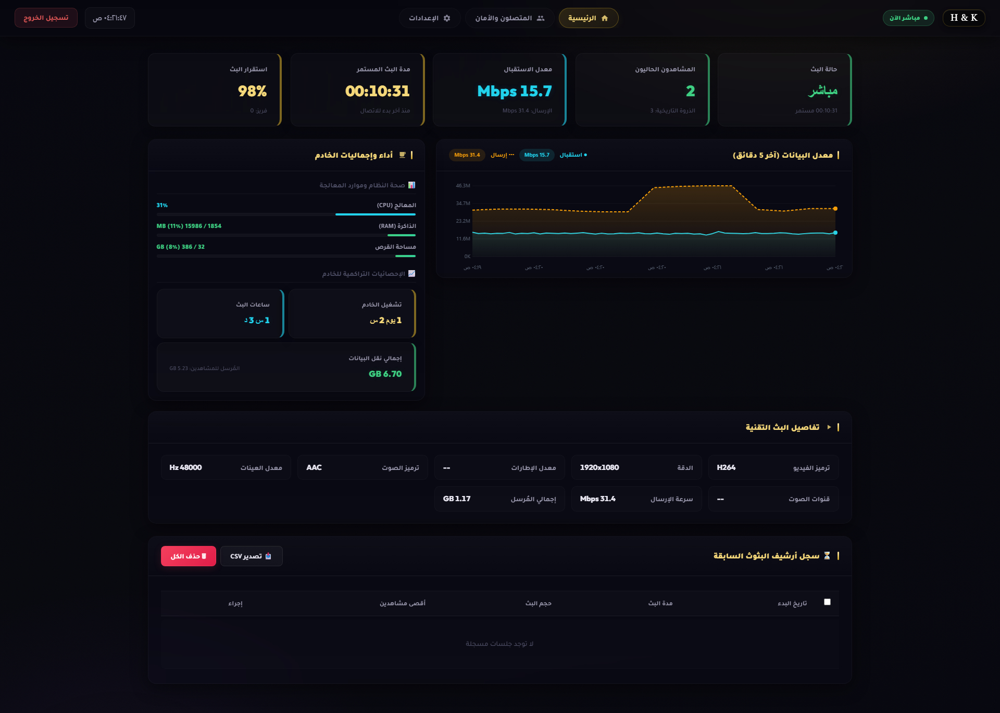
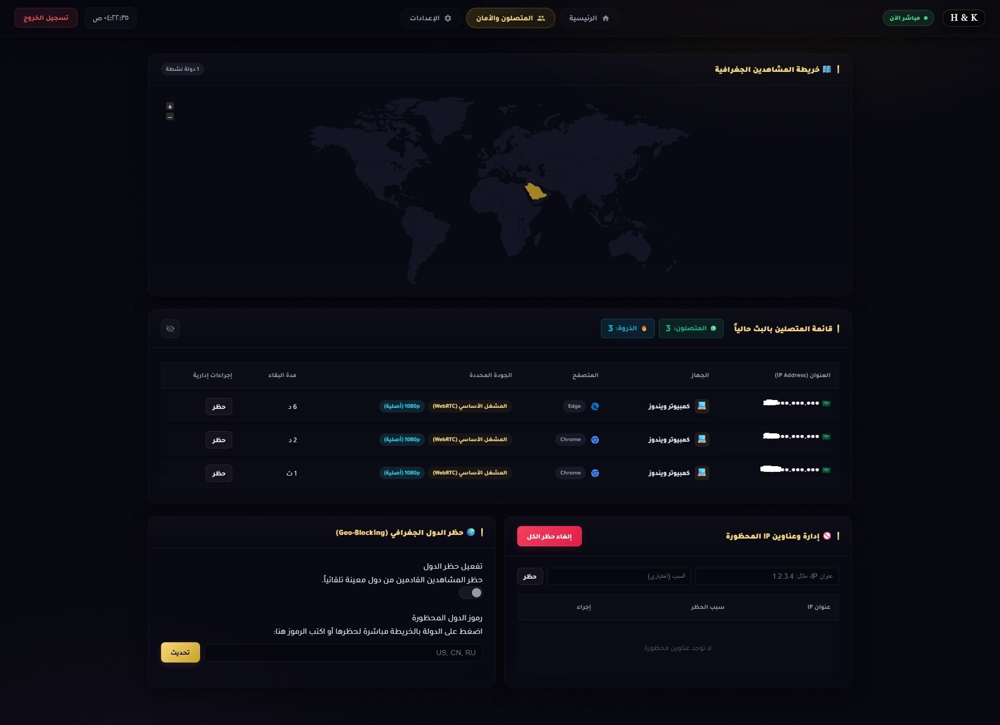
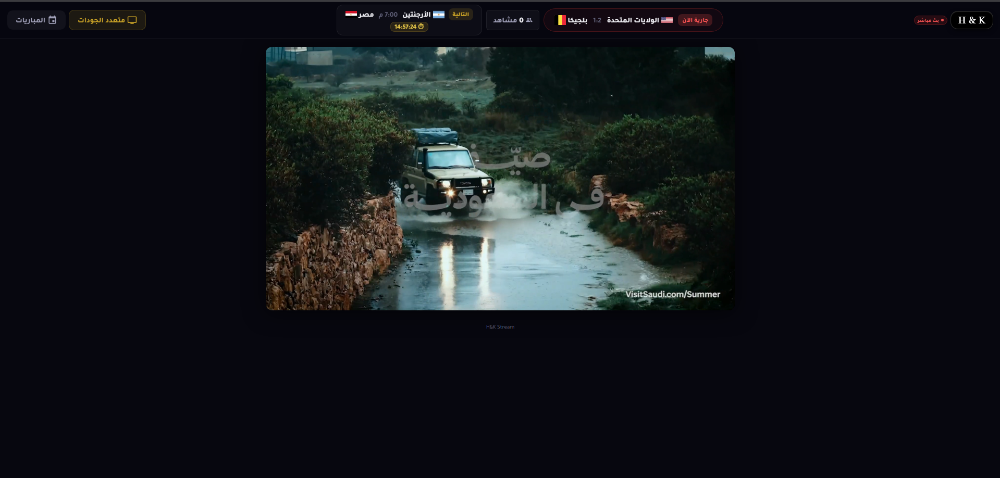
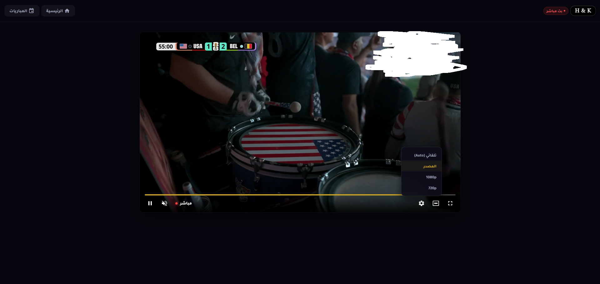

<div align="center">

# HK-Stream

**منصّة بثّ مباشر عربية — منخفضة التأخير وآمنة**

بث OBS مباشرة للمشاهدين في المتصفّح بلا تطبيقات

`OvenMediaEngine` · `nginx` · `Python`

[](https://python.org)
[](https://nginx.org)
[](https://ovenmediaengine.com)
[](#)

</div>

---

## screenshots

<div align="center">

| الرئيسية | لوحة التحكّم | المشاهدون |
|:---:|:---:|:---:|
|  |  |  |

| البث الفردي | البث متعدد الجودات |
|:---:|:---:|
|  |  |

</div>

---

## features

- **تأخير أقل من ثانية** — WebRTC مع LL-HLS كخيار احتياطي
- **بلا ترميز (Bypass)** — يمرّر جودة المصدر كما هي بمعالج شبه معدوم
- **لوحة تحكّم عربية** — حالة البث، المشاهدون الأحياء، الإحصاءات، صحة الخادم
- **حماية متعددة** — كلمة مرور، حظر IP، حظر جغرافي، rate limiting
- **مواعيد مباريات** — تكامل مع football-data.org
- **خصوصية** — مسح تلقائي لعناوين IP وسجلّات nginx عند توقّف البث
- **إشعارات البث** — إشعار متصفّح عند بدء/إيقاف البث
- **PWA** — تثبيت كتطبيق على الجهاز مع تعمل أوفلاين

---

## architecture

```
OBS ──RTMP:1935──▶  OvenMediaEngine  ──webhook──▶  Python Tracker
                       (Docker)         (التحقق)    (المشاهدون/الأمان)
                          │                            ▲
                   WebRTC / LL-HLS                     │ /tracker-api
                          ▼                            │
المتصفّح ◀──HTTPS:443── nginx (reverse proxy) ───────┘
```

1. **البث** — OBS يدفع عبر RTMP إلى OvenMediaEngine
2. **القبول** — يستدعي OME webhook للتحقق من مفتاح البث من Tracker
3. **التوزيع** — يحوّل OME إلى WebRTC + LL-HLS ويعكسهما nginx
4. **المشاهدة** — WebRTC أولاً ثم LL-HLS تلقائياً
5. **التتبّع** — يسجّل المشاهدين والجلسات ويطبّق الحماية

---

## installation

### المتطلبات

- Ubuntu 22.04+ على VPS
- نطاق مُوجَّه (domain)
- Docker

### خطوات التثبيت

**1. تثبيت OvenMediaEngine**

```bash
docker run -d --name ovenmediaengine --restart always --network host \
  -v /opt/ovenmediaengine/origin_conf:/opt/ovenmediaengine/bin/origin_conf \
  airensoft/ovenmediaengine:latest -c origin_conf
```

**2. تثبيت خادم التتبّع**

```bash
sudo apt install python3 python3-pip nginx certbot python3-certbot-nginx ufw

# نشر الكود
git clone https://github.com/abooodHub/HK-Stream.git
cd HK-Stream

# تثبيت الاعتماديات
pip3 install -r requirements.txt

# نشر على المسار الصحيح
sudo cp -r tracker/ome_tracker /opt/ome-tracker/ome_tracker
sudo cp tracker/tracker_rtmp.py /opt/ome-tracker/

# إنشاء ملف .env
sudo tee /opt/ome-tracker/.env <<EOF
FOOTBALL_API_KEY=your_key_here
OME_API_TOKEN=your_token_here
ALLOWED_ORIGIN=https://your-domain.com
EOF
sudo chmod 600 /opt/ome-tracker/.env

# تشغيل كخدمة
sudo cp deploy/ome-tracker.service /etc/systemd/system/
sudo systemctl daemon-reload
sudo systemctl enable --now ome-tracker
```

**3. إعداد nginx + TLS**

```bash
sudo certbot certonly --standalone -d your-domain.com
sudo cp config/your-domain.com.conf /etc/nginx/sites-available/
sudo ln -s /etc/nginx/sites-available/your-domain.com.conf /etc/nginx/sites-enabled/
sudo nginx -t && sudo systemctl reload nginx
```

**4. الجدار الناري**

```bash
sudo ufw allow 22/tcp
sudo ufw allow 80/tcp
sudo ufw allow 443/tcp
sudo ufw allow 1935/tcp
sudo ufw allow 3333/tcp
sudo ufw allow 3334/tcp
sudo ufw allow 3478/udp
sudo ufw allow 10000:10100/udp
sudo ufw allow 9999
sudo ufw --force enable
```

**5. ضبط Server.xml**

عدّل `/opt/ovenmediaengine/origin_conf/Server.xml` وبدّل:
- `<AccessToken>` — توكن OME API
- `<PublicIP>` — IP العام للخادم
- `<DomainName>` — نطاقك

**6. تشغيل البث من OBS**

```
Server: rtmp://your-domain.com:1935/app
Stream Key: stream
```

---

## dashboard

اللوحة متاحة على `https://your-domain.com/dashboard.html`

**كلمة المرور:** تُطبع في سجلّ الخدمة أول مرة:
```bash
journalctl -u ome-tracker -n 30 --no-pager | grep -i pass
```

### الأقسام

| القسم | المحتوى |
|---|---|
| **الرئيسية** | حالة البث، المشاهدون، الذروة، مدّة البث، استقرار البث |
| **صحة الخادم** | المعالج / الذاكرة / القرص بأشرطة ملوّنة |
| **إجماليات الخادم** | فترة التشغيل، ساعات البث الكلّية، حجم البيانات |
| **المشاهدون** | قائمة حيّة (جهاز/متصفح/جودة/دولة) مع إخفاء IP |
| **الأمان** | كلمة مرور المشاهدة، حظر IP، القائمة المحظورة، الحظر الجغرافي |
| **الإعدادات** | تغيير كلمة المرور، تصفير العدادات |

---

## project structure

```
HK-Stream/
├── web/                    # الواجهة
│   ├── index.html          # صفحة البث الرئيسية
│   ├── dashboard.html      # لوحة التحكّم
│   ├── matches.html        # جدول المباريات
│   ├── stats.html          # إحصائيات حيّة
│   ├── js/                 # OvenPlayer + dashboard + player
│   ├── css/                # الأنماط + الخطوط
│   ├── icons/              # أيقونات PWA
│   └── sw.js               # Service Worker
├── tracker/                # خادم التتبّع
│   ├── tracker_rtmp.py     # نقطة الدخول
│   └── ome_tracker/        # الحزمة: auth, handler, ome, store, geoip, matches...
├── config/                 # إعدادات OME و nginx
├── deploy/                 # systemd + nginx
├── fonts/                  # Tajawal + Outfit
└── .env.example            # قالب متغيّرات البيئة
```

---

## environment variables

| المتغيّر | الوصف |
|---|---|
| `FOOTBALL_API_KEY` | مفتاح football-data.org للمباريات |
| `OME_API_TOKEN` | توكن OME API — يطابق `<AccessToken>` في Server.xml |
| `ALLOWED_ORIGIN` | النطاق المسموح به في CORS |
| `TRACKER_HOST` | مضيف ربط التتبّع (افتراضي: `127.0.0.1`) |
| `TRACKER_PORT` | منفذ التتبّع (افتراضي: `9999`) |

---

## security

- لا أسرار في الكود — كل المفاتيح من EnvironmentFile بصلاحية 600
- منافذ داخلية محجوبة — 8081 (OME API) لا يُوصَل إليها إلا من localhost
- مصادقة — bcrypt/sha256 لكلمات المرور، rate limiting، حدّ محاولات الدخول
- حماية IP — حظر/طرد عبر iptables + UFW
- خصوصية — مسح تلقائي لعناوين IP وسجلّات nginx عند توقّف البث
- بيانات حسّاسة مستثناة — `data/` و `.env` خارج Git

---

## tech stack

| التقنية | الاستخدام |
|---|---|
| [OvenMediaEngine](https://ovenmediaengine.com) | محرك البث — WebRTC + LL-HLS |
| [OvenPlayer](https://ovenplayer.com) | مشغّل الويب |
| [nginx](https://nginx.org) | reverse proxy + TLS |
| [Python](https://python.org) | خادم التتبّع + لوحة التحكّم |
| [football-data.org](https://football-data.org) | بيانات المباريات |
| [Let's Encrypt](https://letsencrypt.org) | شهادات TLS المجانية |

---

## license

MIT

---

<div align="center">

صُنع للبثّ العربي

</div>
